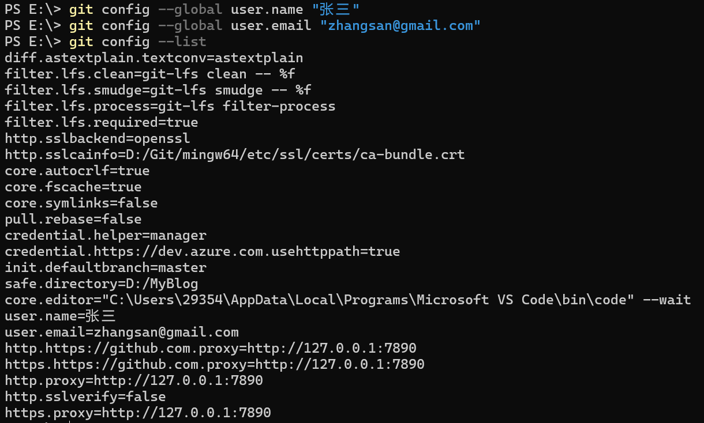
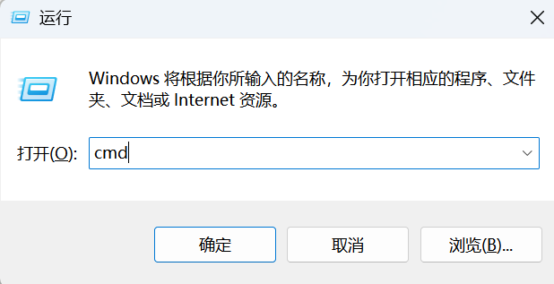
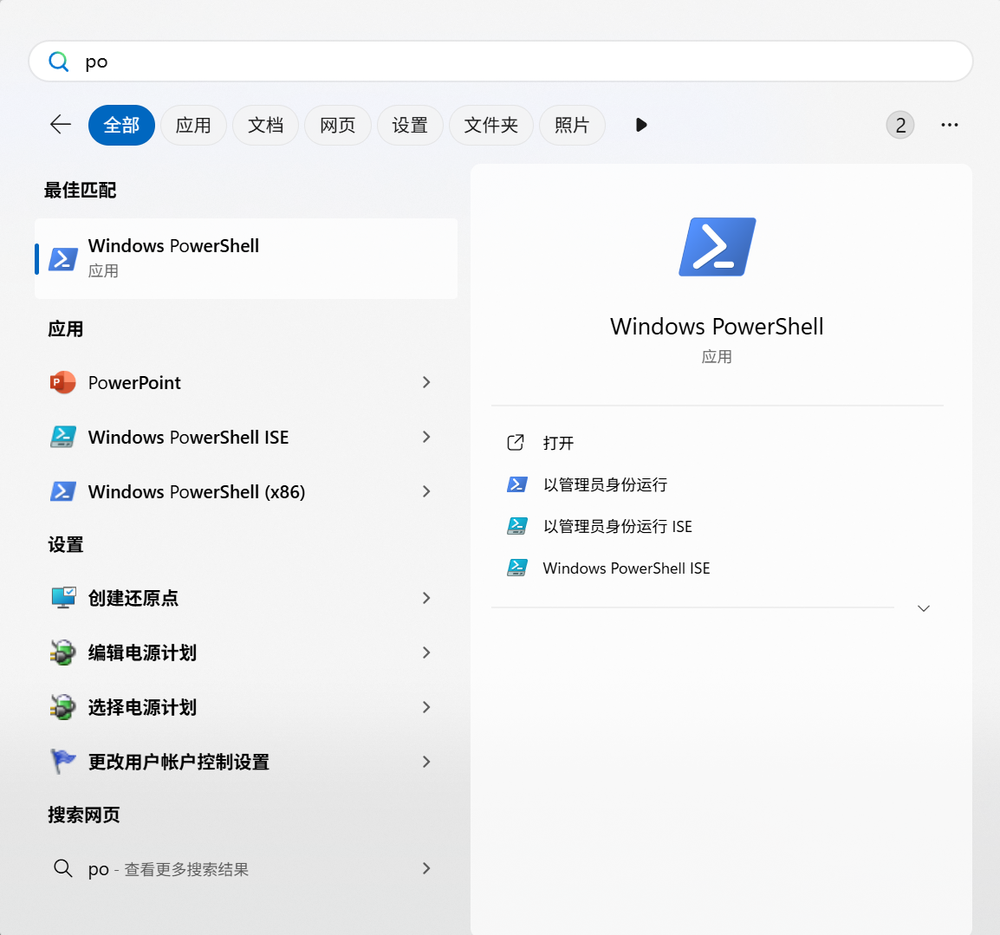

## Git Clone：将文档文件夹所有内容放置到自己的电脑中

* 软件安装

    首先安装Git bash（针对Windows系统）：[Git - Downloading Package](https://git-scm.com/downloads/win)

    安装一个可以提供Git功能的IDE，常用的是Visual Studio Code（即VSCode）：[Visual Studio Code - Code Editing. Redefined](https://code.visualstudio.com/)

* 配置Git环境

    1. Windows系统中：

        打开cmd或者windows自带的powershell；

        配置全局用户名：

        ```bash
        git config --global user.name "你的用户名"
        ```

        配置全局邮箱：

        ```bash
        git config --global user.email "你的邮箱@example.com"
        ```

        此时为了验证配置成功，可以使用指令：

        ```bash
        git config --list
        ```

        效果图示例：

        

    !!! tips
        cmd打开方式：键盘上按住`Win+R`，打开窗口中输入cmd并确定即可；
        
        
        
        powershell打开方式：键盘上按住`Win`，在搜索框中输入`powershell`并打开对应界面；
        
        
