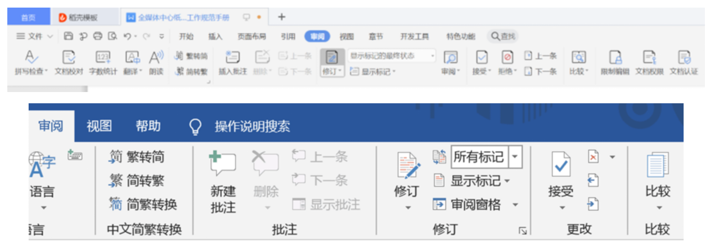
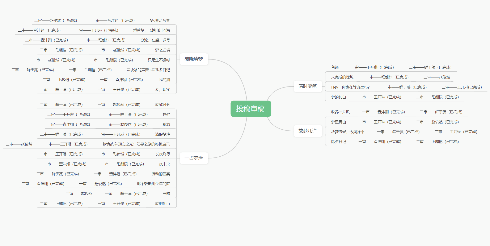
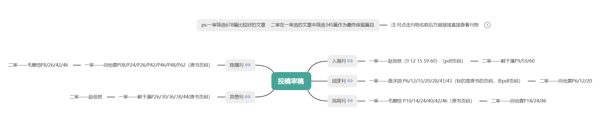
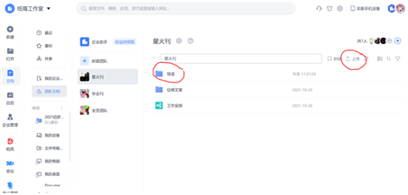
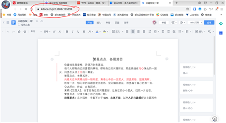
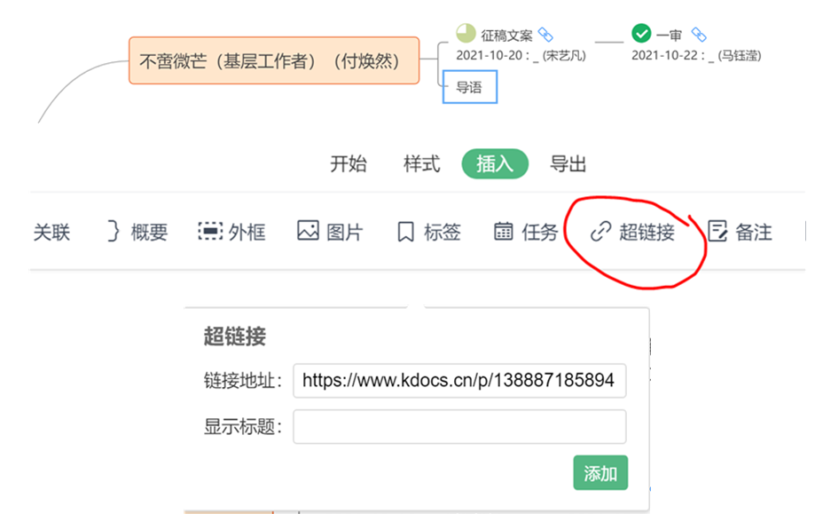
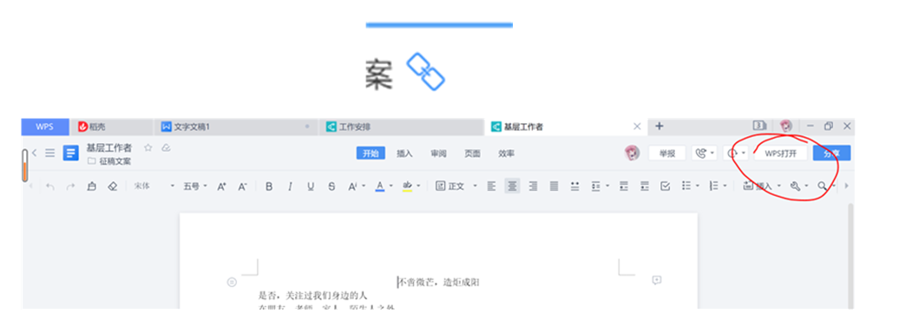

!!! tips
    鉴于旧版的文编工作规范手册内容过少，对诸多工作规范均未有涉及，带来了较多的困扰。因此在过去一年工作的基础上，重新编写了这份手册。在此强调，文编工作过程中需要严格遵守手册中的规范，如果出现不明确或不适用的情况，务必提前与部长副部沟通，如果被发现不遵守规范，可是会有神秘惩罚的噢。

# 文编工作介绍

目前（手册编写时）纸媒的主要工作依然是《竺院人》杂志，还会有不定时的采访、文案撰写等内容。而文编的工作分为写稿与审稿两大部分，写稿包括但不限于杂志上的内部稿、采访稿、新闻稿、多种多样的文案等，审稿则主要是审核要被展现在杂志上的内容（当然也包括内部稿）。在编写每一期杂志的过程中，均会提前选出一个文编和美编担任总策划，负责统筹规划杂志的工作进度，给大家分锅并汇总，并在杂志完成后负责大家的综素申报。下面分别介绍各项工作中的规范。

## 总策划规范

### 主题刊（除新生刊和毕业刊）

作为文编总策，需要协助给其他文编分锅。

一般而言，每一期杂志的撰写过程中我们都会根据杂志主题对外发放问卷和征稿推文，问卷链接除大家自行转发外，还会联系全媒体官方Q号志越以及学生会的小Q帮忙扩散，而征稿推文则要联系新媒体工作室，向其提供文案，之后如上转发推文链接。

联系工作原则上由总策负责。

**一切征稿活动的征稿邮箱均为ckcqmtzm@163.com**，密码询问鲜于藻。在收到投稿后，总策需要尽快将文件下载保存，并统一以“文章题目-作者真名”命名，如“最后一个冬天-xxx”，同时在文件内以统一格式标注作者的信息，如学号、笔名（许多作者都会要求使用笔名）、联系方式等。

杂志中所用到的稿件，一般而言都会经过两次正式审核（某些零散的东西可能只审核一次），均由总策将稿件分给其它文编进行审核。每一次正式审核完毕后，都需要将稿件汇总备份，并确认此时文件的名称为“文章题目-作者真名-X审”，文件内部底部标注了此次审核是由谁负责的，如“一审xxx”。

在两次审核均完成后，总策需要统计所有投稿（不包括内部稿）中被选用的稿件，然后汇总所有投稿的信息，建议在一个单独的文件里注明选用与否、作者真名、学号、字数（被选用的以审核完毕后的字数为准，未被选用的以原字数未准），便于综素申报。内部工作统计则由各个文编自行统计自己的审稿字数（以审核前为准）、写作字数（以审核完毕后为准），再发给总策进行汇总。

需要特别注意的是，文编总策一定要控制好杂志的各项进程，布置并催ddl是十分必要的，否则很可能会拖慢杂志的制作时间。

!!! tips
    征稿推文或班推注意事项：

    1. 写明征稿要求（如字数要求、主题要求、图片要求）；

    2. 写明如第二课堂加分等写稿“好处”（我们自2024年申请到了美育二课分，说服力大了不少呢）鼓励踊跃投稿；

    3. 统一投稿的命名格式要求，如“板块名-题目-作者-班级-学号”，方便总策进行汇总；

    回复投稿注意事项：

    1. 表达感谢；

    2. 杂志将在某某日期左右出版，希望到时候关注。

### 毕业刊

毕业刊建议尽早开始准备，如秋冬学期结束（寒假期间）春夏学期伊始。

大致分为以下四大板块，各板块内容参见往年毕业刊，其它大致与主题刊相同，工作内容和审核次数如下：

1. 大事记 向新媒征收稿件，审一次。总策需要简述选稿理由帮助老师参考，连同稿件交予老师审核；
2. 竺英荟萃 向新媒征收稿件，审一次；
3. 留言板 向本届毕业生分发问卷、向全媒体往届骨干征收稿件（内部的征稿启事，总策撰写）、毕业刊投稿，审二次；
4. 辅导员寄语 与指导老师联系，审二次；
5. 向毕业生的征稿启事（外部）、卷首语，总策撰写。

### 新生刊

2025年新生刊的大致安排如下，可供参考，建议所有新一届干事在春夏学期期末考试后开会讨论分工及建议。

!!! tips
    总时间轴：

    6.23所有干事期末考试结束

    6.29开会，初步讨论

    7.15前初稿收集完毕

    7.18文编完成初审
  
    7.27美编完成排版

    7.28-8.1送老师审核

    8.1-8.5最后修改与审核（包括老师那边的审核）

    8.24大一新生报道

* 卷首语  篇幅不要太长

* 初识浙里 

    来源：浙江大学校网、竺可桢学院院网 （注意与上述网站保持一致）

    关注校园信息是否有变更，如：占地面积等信息是否有变化？

* 浙厢有言 

    列一个包括班型、学长班级和姓名的excel表，确认学长组寄语的征稿情况，并提交给老师，她们针对这些信息初步审核。
  
    寄语中不要出现负能量语词、语句。

* 生存指南

    **一定要更新！！！确定是最新的！**在“选课”板块初审之后发给老师审核  

    文编初审参考浙大本科生院公众号相关内容，修订自习地点、食堂介绍（参考浙大官微、浙大后勤公众号）

    如果不知道怎么搜集资料可以参考以下的链接：[【新生宝典】写给本科新生的ZJU入门资源不完全汇总帖（个人视角）tag：军训 新生](https://www.cc98.org/topic/6253612)

    网络指南——CC98等论坛热词选取要积极向上，注意有些官网的网址URL以及协议可能会随年份更新，需要手动验证并修改，参考以下链接：[对官方公布资源中的新生链接的一点建议](https://www.cc98.org/topic/6255323)。

    内容更新要有出处。杂志内容更新不可能全部覆盖，所以附上公众号等出处（可以用二维码等形式）供同学们自行查阅。

* 我们在浙 

    学生组织提供的照片要正式一点。

    把控好每篇的篇幅，基本参照去年新生刊。

## 审稿规范

一切审稿工作均应该在“审阅模式”下进行，即

在该模式下，对文本进行的一切改动均会被记录，方便后续审（zhui）核（ze），如果对某个地方的改动不能确定或是有修改意见，可以使用“插入批注”进行备注，后续审稿者需要就批注与前者私戳沟通，达成一致后再进行修改。在审稿完成后，审稿者均需在文末注明“X审XX（名字）”，并将文件名改成“XXX（原文件名）-X审”。

具体审稿过程中，建议大家面向搜索引擎审稿，遇到无法判断是否需要修改的地方时（如诗句、名言名句、生僻词语等），先向百度求助。当然向其他同学或部长们询问也是可以的。

特别注意：

1. 标点符号的用法：
    详细资料见附件（内训时介绍）

    引号用法：

    1.提示语在前。

    格式：××说：“-----------------------。”

    2.提示语在中间。

    格式：“---------。”××说，“-------------。”

    3.提示语在后。

    格式：“-----------------------。”××说。

2. 全角半角

    除序号列出如“1.”及一些英文如网址等之外，统一用全角字符。若我们想对格式进行替换，以将此文档中的半角句号字符换成全角句号字符。点击「查找替换」按钮-「替换」，在高级搜索中勾选区分全/半角。查找内容中输入半角句号，替换为输入全角句号，点击全部替换。

    因此，在全角模式下：；“”‘’……~·等为标准符号。输入时可以在键盘上直接敲出，或者在中文输入法中采用中文拼音输出标点，如dian对应·，shengluehao对应……。

3. 删除多处空格
    
    如果遇到如“纸  媒毕竟是官方组织，   文章产出都是要以官方的  名义发表的”之类的文字里有多处空格，在查找替换中将“ ”全部替换为“”。

## 写稿建议

纸媒毕竟是官方组织，文章产出都是要以官方的名义发表的，所以在内容上自然也需要注意。首先肯定是要政治正确；其次是文章的内容整体最好是要积极的。

当然，这些限制都仅针对需要对外展示的内容，纸媒内部依旧是自由的，可以畅所欲言，私戳部长们聊天也是可以的。

## 工作技巧

下面是一些工作中可以用到的小技巧：

我们平时工作中会经常使用金山文档，总策的分锅工作也可以在其中进行，贴一张梦寻刊的思维导图：

稿件多起来之后，审稿分锅的查看与原文翻找的工作就会有些浪费时间，我们可以把稿件或者杂志的超链接粘入分锅的导图中，如精选刊：

!!! tips 

    如何找到对应文档的超链接？

    1.点开“导语”文件夹，上传各板块导语文件

    

    2.登录金山文档网页版，打开上传的导语文件，复制网页地址

    

    3.打开“工作安排”文件，点击对应板块导语，上方插入-超链接，粘贴刚刚复制的网址，点击添加

    

    4.点击这个符号可以直接打开文件，在右上角点击“WPS打开”就是平时操作的页面了

    

## 投稿收集中常见问题的礼貌回答

> 部分来自24级文编成员向怡霖，此处致谢！

### 未能收稿

!!! tips

    虽然你的投稿未能收录于刊物，但还是很感谢你的关注！竺可桢学院官网及“竺院团学汇”公众号会在刊物印刷出来后及时刊登电子版，欢迎阅读，谢谢支持！

### 修改来稿

!!! tips

    示例一：

    同学你好，我们非常开心能收到你的投稿！文中你以笔为马，以文言心，放飞创意，释放灵感，为我们带来一个优秀的科幻作品！

    不过出于刊登需要，我们冒昧地提出几点拙见，或许能为文章增色：

    文中情节跌宕起伏，环环相扣，却略显仓促平淡。（1.部分略写的情节略微有些潦草仓促，如若不影响整体主题表达，或许可以删除部分情节，2.或许在宏观描述场景变换的同时，能够加入更加细腻生动的人物心理描写、在视觉之上引入听觉触觉等多种感官，从而使读者更加身临其境。）

    “xx”是一个十分新颖的立意，但引出略显突兀。最后的升华中，“xx”略显刻意。（或许可以用更委婉地方式层层引出立意，同时在前文更生动地展现xx）

    以上均为一个旁观者浅薄的看法，如有冒犯十分抱歉！！！想请问你是否愿意进行部分修改，可以部分参考括号内的想法，也可以按照你的本心进行增添修订。期盼你能与我们分享一下你的想法，谢谢！

!!! tips

    示例二：

    同学你好，我们非常开心能收到你的投稿！文中你真诚地袒露无数个我们都会有的迷茫与怅惘，却又未止步于此，笔锋一转抒发你的热爱与决心。其中真切的情感表露，细腻的心理描写，丰富的名言引用，均让我们感到这是一篇用心的作品！

    不过出于刊登需要，我们冒昧地提出几点拙见，或许能为文章增色：

    文中的心理描写十分真诚，但是略显平淡与单薄（或许抓住独属于“xx”的特点，挖掘更深的细节可以使文章更为生动？）我们能感到你的热忱，但后半部分却也略显空洞（或许除了名言以外，你可以描述更多独属于你的情感体验）

    以上均为一个旁观者浅薄的看法，如有冒犯十分抱歉！！！想请问你是否愿意进行部分修改，可以部分参考括号内的想法，也可以按照你的本心进行增添修订。希望你能与我们分享一下你的想法，谢谢！

### 毕业生二课分审核

!!! tips

    你好，这个学期可以审核通过。毕业生有一轮特殊的审核，属于提前批，所以可以及时审批二课分。刊物印出来后部长立即申请，经审核你可以看见结果，谢谢！
