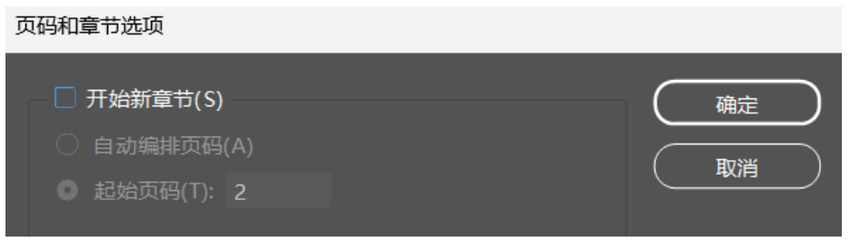

!!! tips
    以下规范基于Windows系统 Adobe InDesign 2023，不同系统、版本的操作界面可能存在差异，使用时应具体问题具体分析。

## 版面规范

### 空白文档预设

页面大小：A4（宽度210毫米，高度297毫米）；

方向、装订与对页：方向为纵向，装订为从左到右，勾选对页；（默认）

起点：1是右页，2是左页；

出血：上下内外均为3毫米；（默认）

### 边距和分栏

边距：**上30毫米**，下20毫米，**内30毫米**，外20毫米；

## 文字规范

### 字体

中文正文：汉仪新人文宋55W（加粗使用汉仪新人文宋75W）

西文正文：Minion Pro Regular

文章标题、小封面导语：自行选择合适的字体，避免与正文宋体相似；

正文字体大小：直接选中网格，设置行间距为7点、字体大小为9点；

其他建议：

1. 新人文宋常用于排版文艺长文等，当排版文章有现代感或科技感需求时，可使用汉仪旗黑55S（加粗使用汉仪旗黑75S）和Avenir LT Std 55 Roman作为正文字体；

2. 中英混排的正文，在英文使用量不大的时候，可以接受使用中文字体的附属西文排版；当大篇幅混排时，须按照上述规范分别设置中西文字体样式；

!!! tips
    1. 正文排版必须使用网格工具，严禁使用文字工具（用于标题、导语等非正文部分）；
    2. InDesign默认字体为Adobe宋体Std L，须手动设置为上述规范字体；尤其值得注意的是，在文本粘贴操作时，会自动使用默认字体，仍需手动设置为规范字体。

### 段落

段首缩进：设置首行左缩进为6.35毫米，或者手动键入两个全角空格（Ctrl+shift+M）；

对齐：双齐末行齐左；（默认）

行末标点悬挂：设置避头尾悬挂类型为强制；

!!! tips
    1. 段首缩进非常容易因为字体修改、粘贴前文本固有缩进等多种原因产生错误，排版时须仔细检查，规范处理；

    2. 行末标点强制悬挂，建议在一个id文档开始时即对全局进行设置（文字→段落→≡→避头尾悬挂类型→强制）；排版中期对全局设置将对已有段落无效，须每一段手动修正.

## InDesign规范

### 页面

建议每名美编在排版时仅新建一个id文件（一人负责多个板块或部分板块的情况除外），新的文章和页面都添加进同一个id文件中，以便后期打包以供美编总策整合；

### 打包

印前检查：在打包操作之前，须检查自己的id文件是否有以下两种常见错误

1. 缺失的链接：链接文件路径变更等导致链接缺失，须重新链接找回缺失的文件；

2. 溢流文本：网格或文本框中文字超出范围，导致文字无法完全显示，形成溢流文本，须将相应溢流位置进行调整；

打包：按照“文件→打包”操作即可；

打包后生成的文件夹如下，应将此文件夹发给美编总策；

检查缺失字体：InDesign通常无法打包中文字体（版权限制），所以须手动将相应字体包加入上图所示的Document fonts文件夹，具体操作如下：

1. “文字→查找/替换字体”，查看所使用的全部字体，并与Document fonts文件夹中已有的字体比较，确定缺失的字体；

2. 字体包须以`.ttf`或`.otf`等格式加入Document fonts文件夹，所以建议大家安装字体时保存好字体包源文件；

3. 如果字体包源文件已删除，则须从系统字体文件夹中找回；以笔者的Windows 11系统为例，在路径`C:\Windows\Fonts`下，找到相应字体，将字体包复制进Document fonts文件夹即可；

!!! tips
    打包过程须严格遵循“印前检查→打包→检查缺失字体”的步骤进行，以便后续美编总策的整合工作顺利开展；

## 美编总策工作

### 封面封底、卷首语与目录

1.封面竺院人标题：

书法坊米芾体（严禁更改）；

字体大小100点、字符间距120点（大小和间距可以根据实际情况适当调整）；

2.目录页编者信息：

人名排版时，须在二字人名的中间插入全角空格（`Ctrl+shift+M`），以保持所有人名等长.

### 合并板块

首先在InDesign打开所有id文件，并新建一个id文件作为杂志汇总的目标文件；

然后按照顺序把各个板块复制进目标文件，具体操作如下：

1.检查打包过来的各个Id文档图层命名，提前将命名改为“文章名+编号”的形式，以防板块合并时图层一起合并导致图片重叠。

在“页面”中，按住shift选中要复制的页面，右键选择“移动页面”，选择“移至”目标文件；

2.在目标文件的“页面”中，可以看到每个板块第一页上边缘有一个倒三角标志，表示这是一个新章节；

3.除了封面页保留倒三角，将其他有倒三角的新章节取消（右键有倒三角的页面，选择“页码和章节选项”，取消勾选“开始新章节”即可），从而把整本杂志合并在同一个章节里；

!!! tips
    1. 合并文件前须做一些准备：
        ①下载Document Fonts文件夹中的所有字体；
        ②打开文档，检查是否存在字体缺失或链接缺失（都会有弹窗提醒），并修复处理之；
    2. 高版本id文件无法使用低版本InDesign直接打开，解决思路如下：
        ①将InDesign升级为高版本（最推荐的方法）；
        ②打开.idml格式文件，重新存储一遍，以转化为低版本id文件；

### 页码编排

杂志的页码从目录后的第一个小封面开始编排，且始终确保页码左偶右奇；

具体而言，可能遇到以下两种情况：

1. 小封面从左页开始，则其页码应当为第2页；

2. 小封面从右页开始，则其页码应当为第1页；

页码编排具体操作如下：

1.在“编辑→首选项→常规”中，将“页码→视图”设置为章节页码；

2.在“页面”中选中第一个小封面，右键选择“页码和章节选项”，勾选“开始新章节”，设置“起始页码”为2或者1（参考上文提及的两种情况）；

3.双击进入“A-主页”，在合适位置设计页码样式；新建一个“主页”图层并置顶，使用文字工具，输入时右键选择“插入特殊字符→标志符→当前页码”即可；

4.将A-主页应用于需要显示页码的页面，可以通过直接拖动A-主页到目标页面，或者选中页面后右键选择“将主页应用于页面”来实现；

!!! tips
    一般而言，小封面不标出页码；此外，如果某些页面标出页码显著影响观感，也可以选择不标出页码.

### 竺院人尾标添加

一般而言，须在一篇完整的文章末尾添加竺院人尾标，尾标大小与单个文字大小相仿；添加小标时，可将图片缩小至一个文字格大小，然后将竺院人小标置于标点符号后的第一个文字格内。

### 导出
导出前须进行“印前检查”，印前检查无误后方可导出,具体步骤为：文件→导出→选择“Adobe PDF（打印）（*.pdf）”，并命名为《竺院人》第xx期·xx刊→确认后，会弹出“导出Adobe PDF”对话框，在兼容性处选择Acrobat 5 (PDF 1.4）；交付印刷时只需要一个PDF文件；

### 样机

杂志制作完成后，美编总策还需要为杂志制作样机，用以放在公众号推文中展示，具体操作如下：

1. 选择样机模板（.psd文件，用Photoshop打开）；

2. 在“图层”中可以看到某些标出颜色的特殊图层（一般为红色），双击这个图层的“智能对象缩略图”（即缩略图，其右下角有一个纸张的小标记），进入一个.psb文件编辑界面；在这个界面下用《竺院人》杂志的截图取代原有内容，并保存，返回样机.psd文件即可；

3. 将样机模板完全替换成《竺院人》杂志样机后，导出为.jpg或.png文件；

!!! tips
    一般而言，需要准备三张杂志样机，且其中必须包括封面；

    

