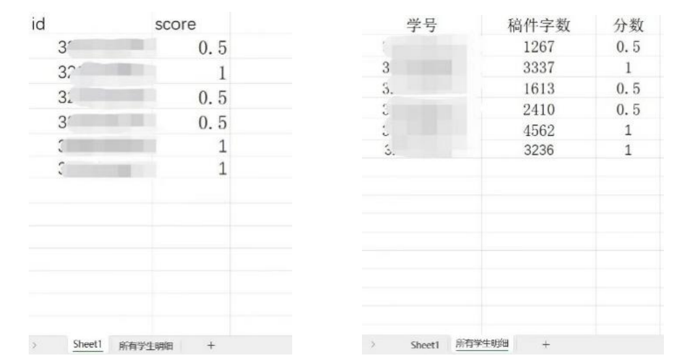
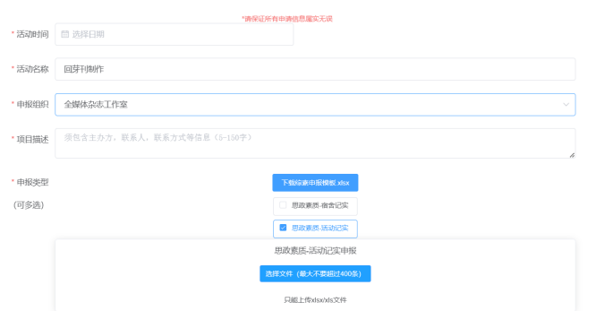

!!! tips 
    该部分的信息可能过时，暂时没有更新，请谨慎鉴别！

## 考核评价
全媒体中心成员考评分为总负责人考评、部长团考评、副部考评和干事考评四个部分，由指导老师、总负责人及各部门负责人主导，全体成员参与。根据工作内容，各部门具体考评标准有所不同，最终按考评标准将当年所有全媒体中心成员分为优秀、良好、合格、不合格四个等级，其中“优秀”人数不超过当年全媒体中心总人数30%。
纸媒工作室干事考评包含部长评价（60%）、副部评价（20%）、干事互评（10%）和个人自评（10%）四个模块。评价依据包括主观的综合评价和客观的工作量统计，后者是对纸媒干事日常工作成果的量化（文编主要体现在撰稿篇幅、审稿字数等方面，美编主要体现在排版页数、插画数量等方面）。
具体内容以《浙江大学竺可桢学院全媒体中心章程》《浙江大学竺可桢学院全媒体中心考评细则》为准。

## 综素申报

### 纸媒内部

纸媒工作室成员根据考核评价结果，学院统一申报社会工作分，无需纸媒另外操作。

### 外部投稿
杂志外部投稿根据稿件质量、文章字数等，给予0.5分或者1分的“思政素质-活动纪实”加分；每制作一期杂志，就要进行一次综素申报。

外部投稿的综素申报具体操作如下：

1.在[团委网站](https://ckcyouth.zju.edu.cn/)登录全媒体账号；登录成功后点击“管理→立项申请”，下载综素申报模板，并在“sheet1”中填上学号及分数，在“所有学生明细”中填上学号、稿件字数及分数，将此表命名为“《xx刊 综素汇总和明细表》（外部投稿）”；

     
2.用全媒体公邮`zhuyuanquanmeiti@163.com`给团委素测部`ckcjskp_2021@163.com`发邮件，邮件写明组织、活动名称、加分类型、分数等，附上《xx刊 综素汇总和明细表》（外部投稿）和杂志终稿PDF文件，素测部回复申请通过后方可进行立项申请；

3.再次进入[团委网站](https://ckcyouth.zju.edu.cn/)并登录全媒体账号；下载综素申报模板，并在“sheet1”中填上学号及分数，将此表命名为“xx刊制作 综素申报”；在网站的“立项申请”中，填写相应信息，勾选“思政素质-活动纪实”，将“xx刊制作 综素申报”表提交；

4.活动申报后，可以在“活动列表”中查看活动审核情况，分为已通过（passApproval）、审核中（underApproval）、已驳回（failApproval）、已撤销（canelApproval）四种情况；

!!! tips

    注意，上述步骤中一共出现过两个Excel表格，分别是“《xx刊 综素汇总和明细表》（外部投稿）”和“xx刊制作 综素申报”，前者内含“sheet1”和“所有学生明细”两张工作表，后者只有“sheet1”一张工作表，切勿混淆!

## 二课分申请

根据院网《竺可桢学院关于第二、三课堂申请立项的相关说明》文件（指路：竺院办公网-学生党团-学生组织-文件），二课分申请分为如下两个流程：

1.活动立项申请

在《竺院人》征稿开始前下载《二、三课堂活动预申请表模版》填写相关信息，并于活动开始至少10天发至邮箱`ckcjskp_2021@163.com` (注意中间的下划线)，邮件标题统一格式为:“组织/社团名称+活动名称+立项申请”。素测部将会据此立项并上交指导老师和学校审核，并再行通知认定审核情况。

所需材料：

（1）预申请表

（2）策划案

!!! tips
    在《二、三课堂活动预申请表》中，
    
    （1）活动具体事项栏请填入活动的主要流程和内容；
    
    （2）活动注意事项栏请填入活动的加分规则。
    
（3）活动海报（不强制）

2.活动认定名单和正式立项申请上传

《竺院人》发刊后，请下载《二、三课堂认定导入人员模版》以及《浙江大学素质拓展认证项目正式立项申请表》，根据申请表内相关要求填写并将两表发至邮箱ckcjskp_2022@163.com (注意中间的下划线)，邮件标题统一格式为:“组织/社团名称+活动名称+导入认定申请”。

素测部将会在审核结束后通知认定情况。

!!! tips
    （1）请确保正式申请前该活动预审核已经通过审核。

    （2）下载立项申请表模板后，需要打印后填写签字后拍照上传。不交立项申请表的项目将不予进行后续审核。交表之前没有上传加分名单的项目也不予进行后续审核。【申请表需要学生名单及一些其他资料，如场地租用证明、活动总结、现场照片等】

    （3）请确保所提交的申请表上有项目管理部门的公章。

    （4）相关文件模板及示例请见附件。

